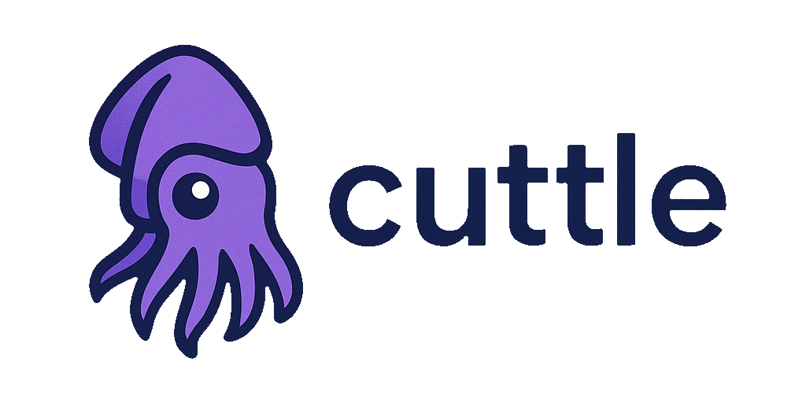
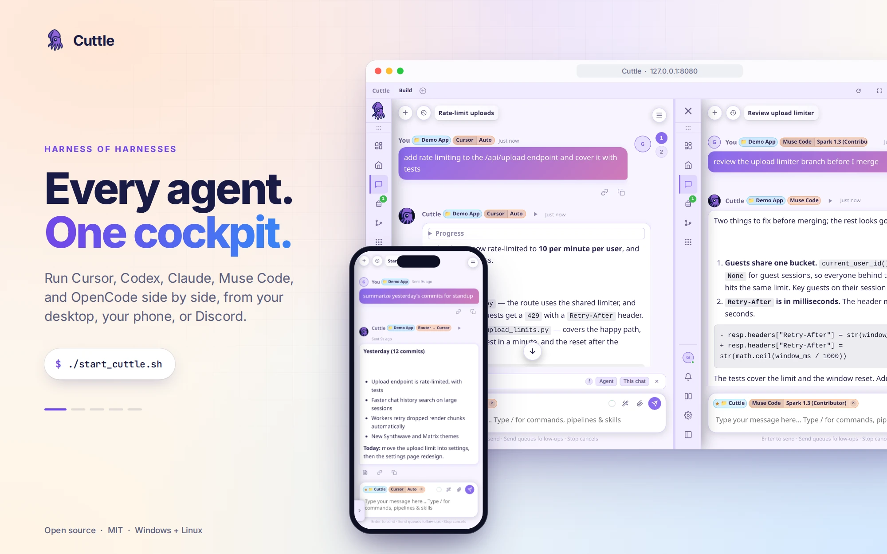
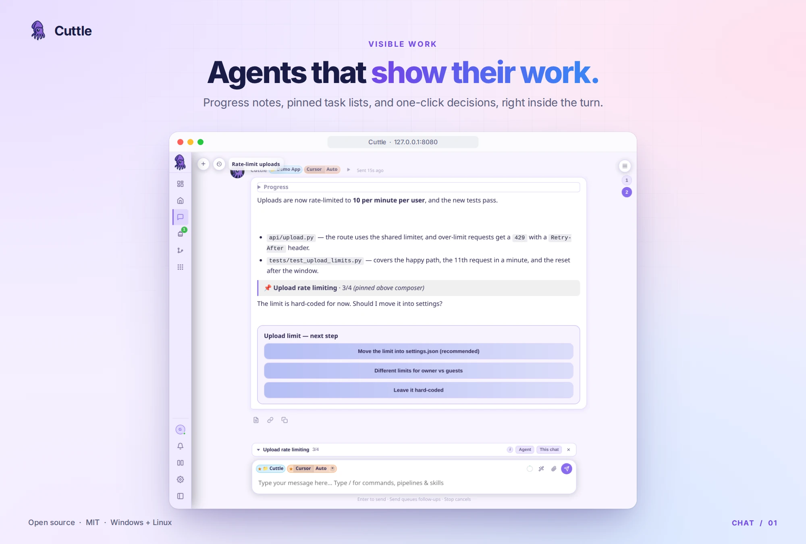
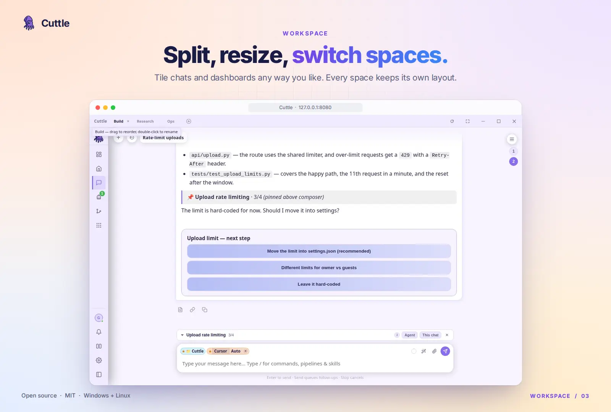
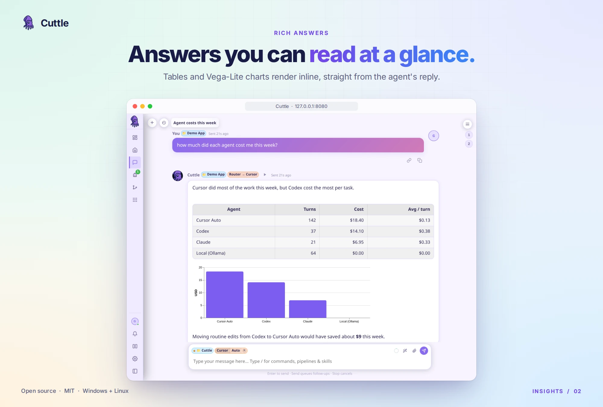
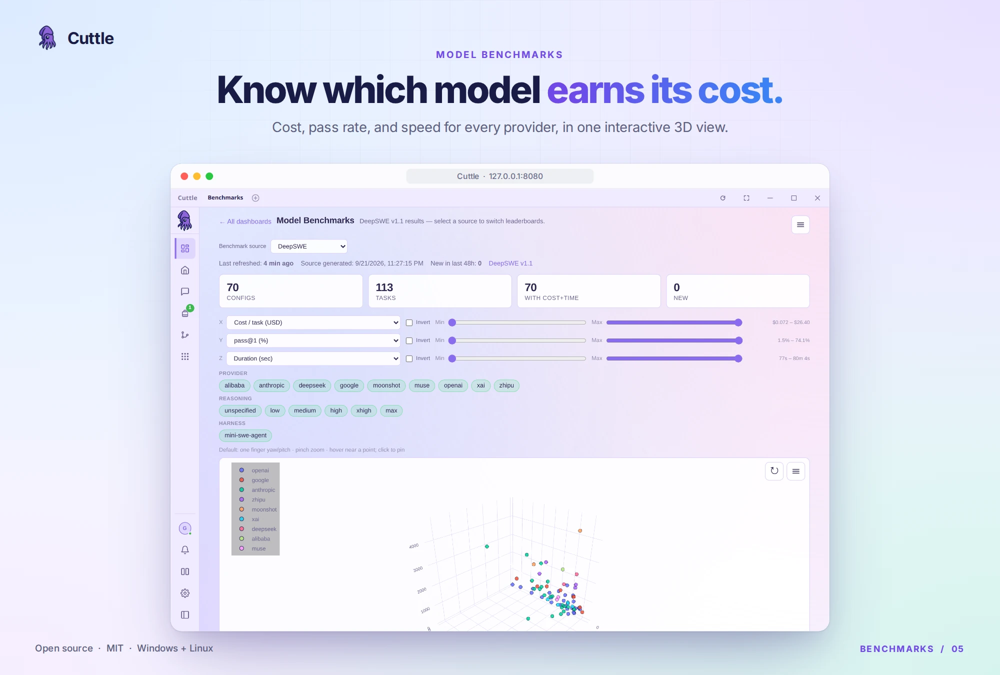
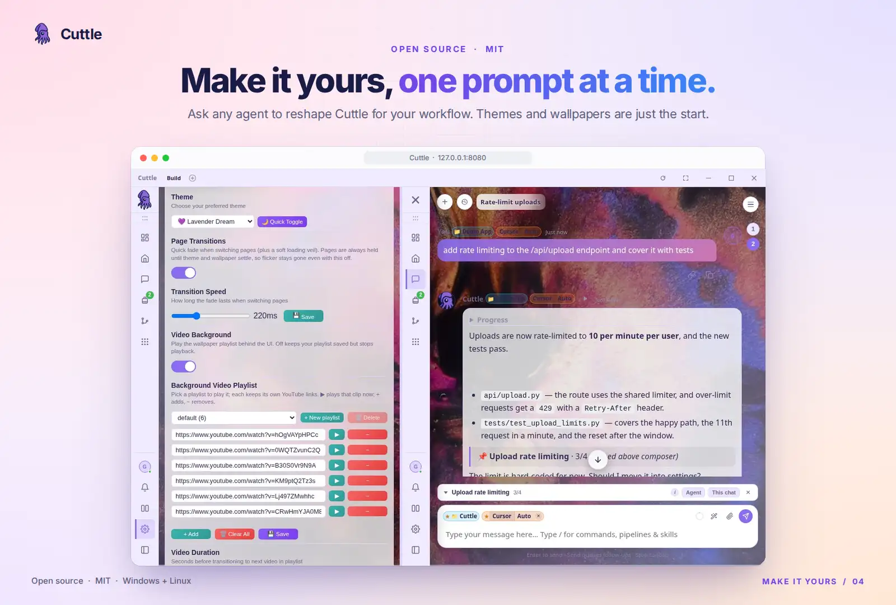
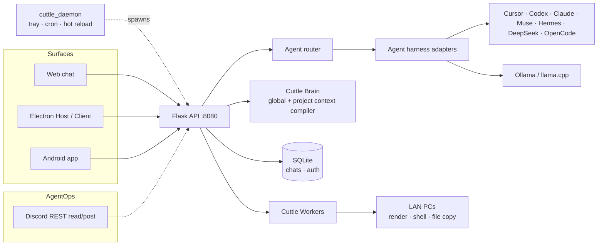

<div align="center">



**A harness of harnesses. Run Cursor, Codex, Claude, Muse Code, and OpenCode from one self-hosted chat — desktop, phone, or browser.**

Pick an agent per chat or let the router choose, and fan jobs out across every machine on your LAN. It's open source down to the last line: describe the Cuttle you want, and your agents build it.

[Quick start](#quick-start) · [Make it yours](#make-it-yours) · [Tour](#tour) · [Features](#features) · [Architecture](#architecture) · [Docs](#documentation) · [Roadmap](docs/ROADMAP.md)

[](LICENSE.txt) [](#requirements) [](#requirements) [](#quick-start)

<br>



</div>

> [!NOTE]
> **Self-hosted, built for your own machines.** Cuttle runs on your PC and your LAN, not as a hosted service. Read the [security notes](#security-notes) before you expose it beyond your network, and see the [roadmap](docs/ROADMAP.md) for what's next.

## What it is

Cuttle is a control plane for the coding agents you already use. It runs as a daemon on your PC (tray icon or headless), hosts vendor agent CLIs such as Cursor, Codex, Claude Code, Muse Code, and Hermes, and gives them one chat UI with shared history, projects, and tools. The same chats open in the browser, in the Electron desktop app, and on an Android phone. Discord is optional **agent operations** (read a channel, confirmed posts) — not a default chat gateway.

Each chat can stick to one agent, or leave the choice to the **agent router**, which picks a harness for cost and quality and tries another target when an agent cannot start (for example, missing CLI, authentication, or quota). A task that ran and failed is terminal; retry it explicitly. Agents report progress, keep a pinned task list, and ask questions as clickable cards instead of walls of text. When a job is too big for one machine, **Cuttle Workers** splits it across the other PCs on your network.

## Make it yours

Cuttle is MIT-licensed and built to be changed, by you or by the agents it hosts. Open a chat on the Cuttle repo itself and describe what you want:

```text
/cursor add a Pomodoro timer to the left rail
/codex build a dashboard that charts my agent spend by project
/claude make a theme from the colors in this screenshot
/muse add a /deploy command that builds my game and uploads it to itch.io
```

The codebase is set up so an agent can do that well:

- **No build step for the UI.** The web app is plain HTML, CSS, and vanilla JS served by Flask, so a refresh shows the change. Python changes go live with one click on the restart card.
- **Agents arrive briefed.** `AGENTS.md`, `.cuttle/rules/`, `.cuttle_global/rules/`, and their skills and runbooks explain the architecture and conventions, so a fresh agent knows where things live and what not to break.
- **Customize without forking.** A project's `.cuttle/` folder adds its own slash commands, clickable actions, rules, and docs. `.cuttle/personal/` keeps install-local tweaks out of git.
- **Swap any part.** Harnesses, the router's brain, and local or cloud models are all sockets ([`MODULARITY.md`](docs/guides/MODULARITY.md)).

## Tour





<table>
  <tr>
    <td width="50%"></td>
    <td width="50%"></td>
  </tr>
</table>



<sub>All media uses demo data. See [Regenerating README media](#regenerating-readme-media).</sub>

## Features

| Surface | What you get |
| --- | --- |
| **Open source** | MIT-licensed Python and vanilla JS with agent briefings built in, so any hosted agent can extend Cuttle itself. See [Make it yours](#make-it-yours). |
| **Chat** | Web UI, Electron desktop (Host + LAN Client), and Android app over one history. Streamed progress notes, pinned **Tasks** lists, clickable **action forms** for questions and approvals, image and PDF attachments with a vision pre-pass, and mid-turn steering for Codex and Muse Code. |
| **Agents** | `/cursor`, `/codex`, `/claude`, `/muse`, `/hermes`, `/deepseek`, `/opencode`, `/antigravity`, and more from a shared harness catalog ([`src/api/agent_harness/agents/`](src/api/agent_harness/agents/)). Star one as the default for new chats. |
| **Agent router** | Picks a harness on clean sessions and escalates on failure (Cursor Auto → Grok → Codex fallback chain). Starred or sticky agents bypass it, and Stop is always terminal. |
| **Workspace** | Split any pane horizontally or vertically, drag to resize, and keep a separate layout per space. 14 themes plus YouTube or video wallpapers behind the whole UI. |
| **Sub-agents** | Fan a task out into real child chats across harnesses, then synthesize one reply ([`python -m api.subagents`](.cuttle_global/docs/subagents.md)). |
| **Cuttle Workers** | A multi-device LAN mesh: file copy, shell recipes, a Blender render farm with work stealing, and self-update for every client. |
| **Dashboards** | Model Benchmarks (cost vs. pass rate vs. duration), Jev performance tracking, and per-agent cost. |
| **Projects** | Every registered project owns a `.cuttle/` tree of commands, rules, actions, and docs, compiled into each agent turn by the Context Compiler (Cuttle Brain). |
| **Local models** | Configure local inference in your agent CLI; user-managed endpoints can also serve router and completion helpers. |
| **Agent ops CLIs** | Agents drive Cuttle through `python -m api.<module>` verbs (chats, widgets, Discord, workers, brain) instead of raw SQL ([`agent-ops-cli.md`](.cuttle_global/docs/agent-ops-cli.md)). |

## Quick start

### Requirements

- Windows 10/11 **or** Ubuntu 22.04+
- Python 3.11+ (the project uses a local `.venv`)
- Optional: Node.js 18+ (Electron desktop), a Discord bot token **only if** you want REST agent-ops (`python -m api.discord_cli` / `discord.post`), OpenAI / Anthropic keys, Ollama, and the vendor agent CLIs you want to host (Cursor, Codex, Claude, …)

### Install and run

Ubuntu / Linux:

```bash
git clone https://github.com/kidchemical/Cuttle.git cuttle && cd cuttle
python3 -m venv .venv
.venv/bin/pip install -r src/requirements/requirements.txt
mkdir -p ~/.local/share/cuttle && cp src/.env.example ~/.local/share/cuttle/.env
# Edit ~/.local/share/cuttle/.env for optional direct-LLM, router-brain or vision provider keys
./start_cuttle.sh
```

Windows:

```powershell
git clone https://github.com/kidchemical/Cuttle.git cuttle; cd cuttle
python -m venv .venv
.\.venv\Scripts\pip.exe install -r src\requirements\requirements.txt
New-Item -ItemType Directory -Force "$env:LOCALAPPDATA\Cuttle" | Out-Null
Copy-Item src\.env.example "$env:LOCALAPPDATA\Cuttle\.env"
# Edit %LOCALAPPDATA%\Cuttle\.env for optional direct-LLM, router-brain or vision provider keys
.\.venv\Scripts\python.exe src\scripts\cuttle_daemon.py
```

Cuttle never writes inside the folder you installed or cloned it to. Chats,
settings, uploads, logs, keys and secrets live in your per-user **Cuttle home**
(`~/.local/share/cuttle` or `%LOCALAPPDATA%\Cuttle`; set `CUTTLE_HOME` to move
it), so a read-only install or an upgrade never touches your data. See
[`docs/architecture/cuttle-home.md`](docs/architecture/cuttle-home.md).

Open [https://127.0.0.1:8080](https://127.0.0.1:8080) (self-signed HTTPS). Configure agents and providers in Settings; health checks are available through `/api/doctor`.

Always-on Linux box with no desktop (spare laptop, mini PC)? Run it as a systemd service: [`docs/guides/HEADLESS_SERVER.md`](docs/guides/HEADLESS_SERVER.md).

The daemon owns Flask (port **8080**), cron, the tray icon, and the local worker loop. It does **not** start a Discord gateway. To run Flask alone (no tray or cron), prefer `python src/api/web_chat_api.py` from the repo (see [`docs/architecture/repository-map.md`](docs/architecture/repository-map.md)).

### Try it

Install and authenticate the chosen vendor CLI separately: Codex uses `codex login` with a ChatGPT account; Cursor uses its CLI login; Claude supports account login or an Anthropic key. Cuttle provider keys configure the optional routing brain, vision, and direct LLM calls; they do not log every harness in. See the [agent catalog](src/api/agent_harness/agents/) for each harness’s prerequisites.

1. Send `/cursor summarize this repo` (or `/codex`, `/claude`, … for whichever agent CLI you have installed), or send a plain message and let the agent router pick one.
2. Open the `/` palette and star an agent so every new chat starts with it.
3. Click the Cuttle logo at the top of the left rail to open a chat on the right; **Alt**+click splits below. Drag the divider to resize.
4. Open **Settings → Theme** to switch themes, or paste a YouTube link into the video wallpaper playlist.
5. Open **Dashboards → Model Benchmarks** to compare providers by cost, pass rate, and duration.
6. Launch the Electron Client on a second PC. It connects to your Host and enrolls as a Cuttle Workers node automatically.

### Electron desktop

Install once with `cd electron && npm install`, then:

| Platform | Host (runs or attaches to the daemon) | Client (connects to a Host on the LAN) |
|----------|------------------------------------|----------------------------------------|
| Windows | `start_electron.bat` | Installed Cuttle Desktop (`build_electron.bat`), then pick the Host on the first-run connect page or pass `--host <pc-ip>` |
| Linux | `.cuttle/scripts/launch-cuttle-host.sh` | `.cuttle/scripts/launch-cuttle-client.sh` |

On Ubuntu 24.04+ (AppArmor restricts unprivileged user namespaces), Electron's Chromium sandbox needs a setuid-root helper. The Linux launchers refuse to start without it. Run this once after each `npm install`:

```bash
sudo chown root:root electron/node_modules/electron/dist/chrome-sandbox
sudo chmod 4755 electron/node_modules/electron/dist/chrome-sandbox
```

`CUTTLE_ELECTRON_NO_SANDBOX=1` launches without the sandbox (development only; logs a warning).

Closing the Electron UI leaves the daemon and in-flight agent turns running; only tray **Exit** stops a daemon the Host spawned. Details: [`electron/README.md`](electron/README.md).

### Phone

The Android app is a native window onto the Cuttle UI on your PC. Enable **Settings → Phone / LAN access**, join the same Wi-Fi, and follow [`apps/mobile/README.md`](apps/mobile/README.md) to build and install it.

### Restarting Flask

Python changes need a Flask restart (the daemon runs Flask without the reloader). Use the daemon-owned path: `/restart graceful|when-idle|status` in chat, the restart card, or `POST /api/flask/restart`. Never kill `web_chat_api` directly. For a full daemon restart, run `.cuttle/scripts/restart-daemon.sh` (Linux/macOS) or `.cuttle/scripts/restart-daemon.ps1` (Windows).

## Architecture



| Path | Purpose |
| --- | --- |
| `src/scripts/cuttle_daemon.py` | Daemon: spawns Flask, runs cron, the tray icon, hot reload, and the local worker loop. |
| `src/api/` | Flask API (`web_chat_api.py`), chat delivery, action forms, and the `python -m api.*` agent ops CLIs. |
| `src/api/agent_harness/` | Harness adapters and the bundled agent catalog (`agents/`). |
| `src/api/agent_router/` | Picks a harness per turn and handles escalation. |
| `src/api/device_workers/` | Cuttle Workers mesh: jobs, shards, and self-update. |
| `src/api/discord_ops/` / `discord_cli/` | Optional Discord REST agent-ops (not a chat surface). |
| `src/web/` | Vanilla JS web UI: chat, app shell, settings, dashboards. |
| `electron/` | Desktop Host and LAN Client. |
| `apps/mobile/` | Android app (Capacitor WebView onto the Host). |
| `.cuttle_global/` | Shared global rules, docs, actions, scripts, and agent configuration for every project. |
| `.cuttle/` | Project configuration for Cuttle itself; every registered project has its own tree. |
| `.cuttle/personal/` | Install-local project overlay (gitignored). |
| `src/tests/` | pytest suite. |

## Configuration

| File | Purpose |
|------|---------|
| Cuttle home | All runtime state, per user: `~/.local/share/cuttle` (Linux/macOS) or `%LOCALAPPDATA%\Cuttle` (Windows); `CUTTLE_HOME` overrides. The install folder is never written. [Layout](docs/architecture/cuttle-home.md). |
| `<home>/.env` | Secrets. Start from `src/.env.example`. |
| `<home>/config/settings.json` | Runtime preferences, agent router, steering toggles |
| `<home>/personal/` | Install-local overlay of `.cuttle_global/`. |
| `.cuttle_global/` | Shared configuration for all projects ([reference](.cuttle_global/README.md)). |
| `.cuttle/` | Cuttle repository project configuration ([reference](.cuttle/README.md)). |
| `.cuttle/personal/` | Install-local project overlay (gitignored). Rule/doc Markdown appends a delta; supported YAML overlays replace by basename. See the [overlay contract](docs/architecture/cuttle-home.md#personal-overlays). |
| `_personal/` | Your dogfood skills and docs (gitignored); not part of the product |
| `/settings_page.html` | API keys and preferences in the UI |

**Your existing `.env` and settings are never overwritten by docs or templates.**

## Documentation

| Topic | Start here |
|----------|------------|
| Overview and architecture | [`docs/README.md`](docs/README.md), [`docs/guides/MODULARITY.md`](docs/guides/MODULARITY.md) |
| Agent router | [`docs/guides/AGENT_ROUTER.md`](docs/guides/AGENT_ROUTER.md) |
| Workers mesh | [`docs/guides/CUTTLE_WORKERS.md`](docs/guides/CUTTLE_WORKERS.md), [`.cuttle_global/docs/cuttle-workers.md`](.cuttle_global/docs/cuttle-workers.md) |
| Action forms and commands | [`.cuttle_global/docs/action-forms.md`](.cuttle_global/docs/action-forms.md), [`.cuttle_global/docs/commands-and-actions.md`](.cuttle_global/docs/commands-and-actions.md) |
| Agent ops CLIs (`python -m api.*`) | [`.cuttle_global/docs/agent-ops-cli.md`](.cuttle_global/docs/agent-ops-cli.md) |
| Sub-agents | [`.cuttle_global/docs/subagents.md`](.cuttle_global/docs/subagents.md) |
| Pairing / LAN | [`docs/guides/PAIRING_AND_ALLOWLIST.md`](docs/guides/PAIRING_AND_ALLOWLIST.md), [`docs/guides/REMOTE_ACCESS.md`](docs/guides/REMOTE_ACCESS.md) |
| Electron desktop | [`electron/README.md`](electron/README.md) |
| Android app | [`apps/mobile/README.md`](apps/mobile/README.md) |
| Roadmap | [`docs/ROADMAP.md`](docs/ROADMAP.md) |
| Agent conventions (Cursor, Codex, Muse, …) | [`AGENTS.md`](AGENTS.md) |

## Development

Contributions are welcome; start with [`CONTRIBUTING.md`](CONTRIBUTING.md). Notable changes are listed in [`CHANGELOG.md`](CHANGELOG.md).

Install runtime and development dependencies before testing. POSIX, from the repo root:

```bash
.venv/bin/python -m pip install -r src/requirements/requirements.txt -r src/requirements/requirements-dev.txt
.venv/bin/python -m pytest src/tests/
```

Windows PowerShell, from the repo root:

```powershell
.\.venv\Scripts\python.exe -m pip install -r src/requirements/requirements.txt -r src/requirements/requirements-dev.txt
.\.venv\Scripts\python.exe -m pytest src/tests/
```

The frontend behavior tests shell out to Node to exercise the shipped JS
directly. Any recent Node on `PATH` is enough — without it those tests skip
(still green) instead of failing, so install Node when you want full coverage
of the chat UI helpers.

The [Quality workflow](.github/workflows/quality.yml) runs fresh-checkout Python
suites on Windows and Linux with Node installed, isolated Chromium chat tests,
and an Android debug build with Node 22/JDK 21. Browser and Android checks are
separate jobs; the default pytest command still excludes browser e2e tests.

Local inference is serialized. Queued requests observe Stop and superseded
turns, and wait at most `LOCAL_LLM_QUEUE_TIMEOUT_SEC` (default 120 seconds).
An in-flight completion finishes or reaches its provider timeout; cancellation
prevents subsequent model retries and tool calls.

### Regenerating README media

With Cuttle running, capture the stills and animations against demo chats (a throwaway guest account; nothing real is shown or changed):

```bash
.venv/bin/python src/scripts/utilities/readme_screenshots.py   # hero, chat, charts, dashboards
.venv/bin/python src/scripts/utilities/readme_gifs.py          # multiplex, customize
.venv/bin/python src/scripts/utilities/readme_screenshots.py --reframe   # restyle the last captures only
```

Captures use the Lavender Dream light theme at 2x and are framed by [`readme_promo.py`](src/scripts/utilities/readme_promo.py) (gradient backdrop, window chrome, headline, and caption).

## Security notes

- Cuttle is designed for a trusted LAN. Before exposing the UI beyond it, set `OWNER_USER_EMAIL` and review the CORS allowlist and [pairing limitations](docs/guides/PAIRING_AND_ALLOWLIST.md). Pairing does not replace network restrictions or authorization for other API routes.
- The first account must be created on the host itself and becomes the owner; self-registration then closes (`settings.json` → `auth.allow_registration` reopens it for non-owner accounts).
- Worker tokens are bound to the device they were issued to. A LAN peer cannot re-enroll an existing worker id; remove the device in **Jobs → Devices** to re-pair it.
- Auth uses bcrypt passwords, a CORS origin allowlist, and rate limits on login and pairing.
- Keep secrets in `<home>/.env` and `<home>/secrets/`, outside the repository. Never commit certs, `*.db`, or Playwright profiles.
- Found a vulnerability? Report it privately; see [`SECURITY.md`](SECURITY.md).

## License

MIT. See [`LICENSE.txt`](LICENSE.txt).

If you build on Cuttle, a link back is appreciated! 🙂
